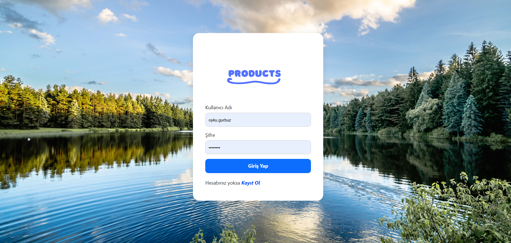
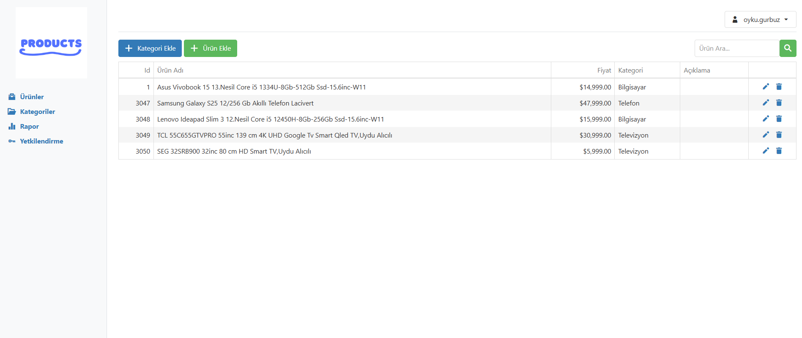
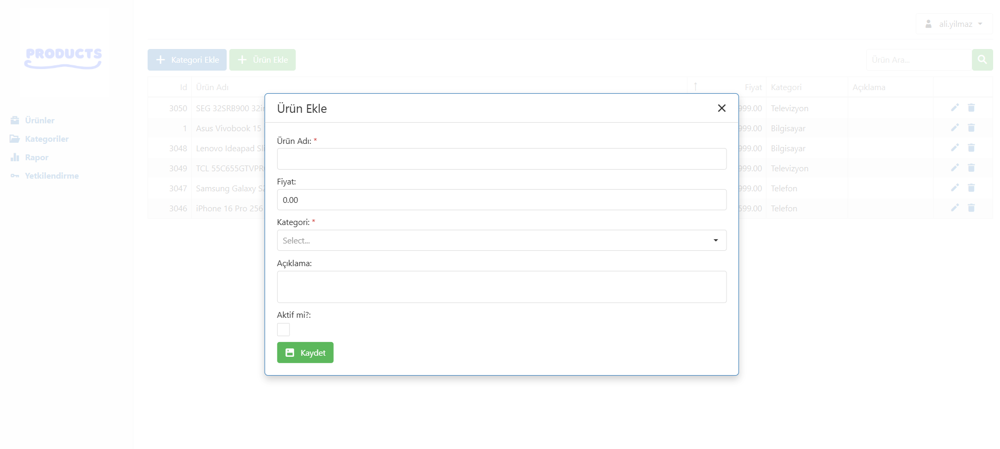
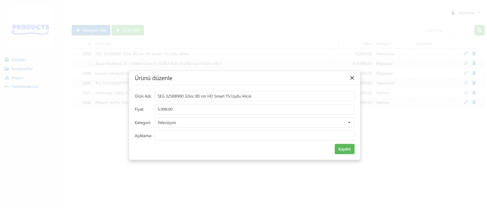
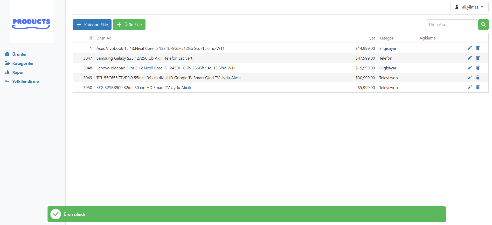
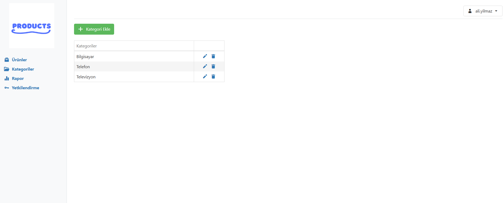
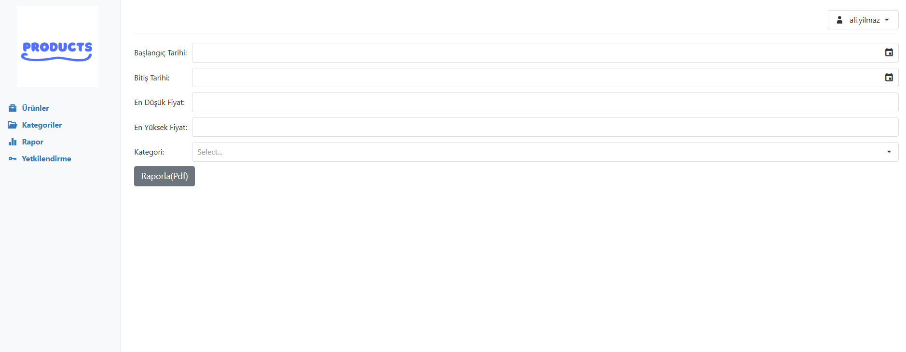
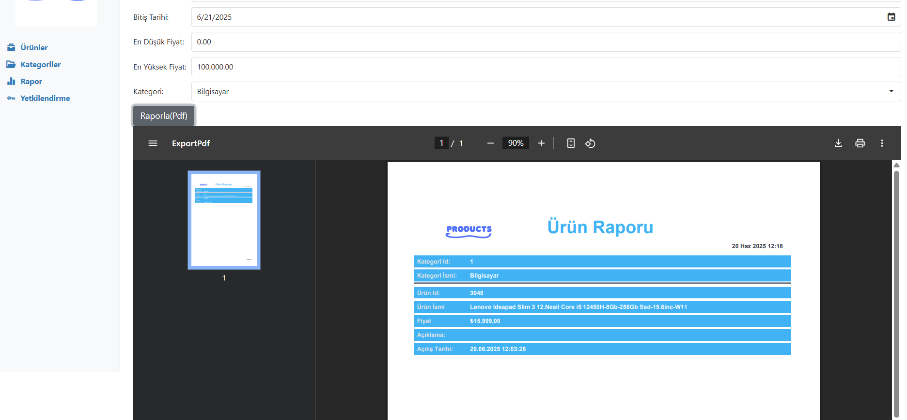
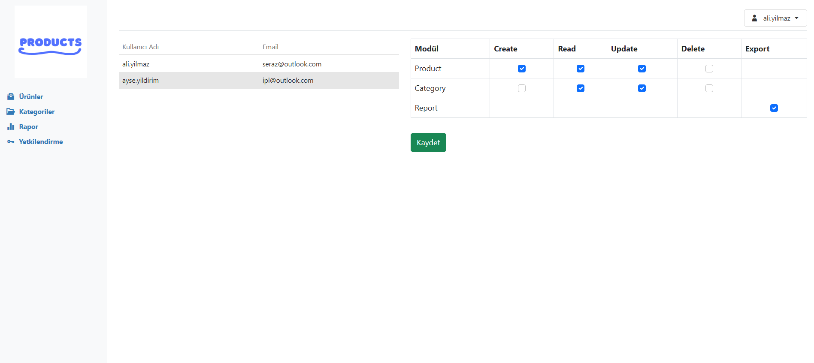
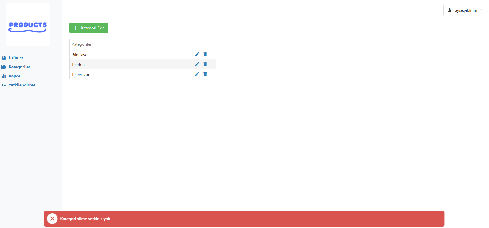

# WebApp_Demo-master

# WebAppDemo_update (.NET Core MVC UI)

Bu proje, oluşturmuş olduğum JwtToken_Project (kullanıcı kimlik doğrulama ve yetkilendirme işlemlerini JWT (JSON Web Token) kullanarak gerçekleştiren bir ASP.NET Core Web API uygulaması) ile entegre olarak çalışır. Kullanıcıların giriş yaparak ürün/kategori CRUD işlemleri yapmasını sağlar ve DevExpress bileşenleri ile zenginleştirilmiştir. Tarih, fiyat ve kategori filtreli raporlama yapar.CRUD işlemleri için kullanıcı bazlı yetkilendirme (okuma, ekleme, güncelleme, silme) yapar.

#Özellikler

- Kullanıcı kimlik doğrulama işlemleri (API üzerinden JWT ile)
- JWT token cookie olarak saklanır (HTTPOnly güvenliği ile)
- Ürün ve Kategori CRUD işlemleri
- Yetki tabanlı işlem izni (okuma, ekleme, güncelleme, silme kontrolü)
- Kullanıcıya özel authority level
- Action bazlı HasPermission attribute yapısı
- Kategori, fiyat ve tarih aralığına göre gelişmiş filtreleme,raporlama ve raporların iframe ile sayfa içine gömülmesi
- DevExpress bileşenleri ile ile zengin arayüz

#JWT

- Kullanıcı, API aracılığıyla giriş yaptığında sunucudan bir JWT Token döner.
- Bu token, cookie içerisine (HTTPOnly flag ile) kaydedilir.
- Cookie tarayıcıda saklandığı için token güvenli bir şekilde taşınır; JavaScript erişemez.
- Her istek otomatik olarak bu token ile yapılır; kullanıcı kimliği korunur.
- #Yetki Tabanlı İşlem İzni

Kullanıcıların hangi işlemleri yapabileceği, yetki (permission) tablosu ve kullanıcıya bağlı izinlerle kontrol edilir.
Bunun için özel bir [HasPermission] attribute sınıfı tanımlanmıştır.

### Örnek kullanım:
```csharp
[HasPermission("Product.Create")]
public IActionResult CreateProduct() { 
     // yalnızca bu yetkiye sahip kullanıcılar erişebilir
 }
 ```

Kullanılan Teknolojiler
- ASP.NET Core MVC (.NET 8)

- DevExpress JavaScript ve Reporting v24.2+

- Entity Framework Core

- Cookie tabanlı JWT saklama

# Uygulama Arayüzü

## Giriş Ekranı görünümü: 

 

## Ürünler

### Ürün listesi görünümü: 



### Ürün Ekleme PopUp görünümü: 



### Ürün Düzenleme PopUp görünümü: 



### Ürün Silme PopUp görünümü: 



##Kategoriler



##Rapor
### Filtreleme:



### Rapor Pdf



### Yetkilendirme Sayfası 



### Yetkili olmayan kullanıcıya geribildirim


.png)