# WebApp_Demo-master

# WebAppDemo_update (.NET Core MVC UI)

Bu proje, oluşturmuş olduğum JwtToken_Project (https://github.com/oykugurbuz/JwtToken_Project) (kullanıcı kimlik doğrulama ve yetkilendirme işlemlerini JWT (JSON Web Token) kullanarak gerçekleştiren bir ASP.NET Core Web API uygulaması) ile entegre olarak çalışır. Kullanıcıların giriş yaparak ürün/kategori CRUD işlemleri yapmasını sağlar ve DevExpress bileşenleri ile zenginleştirilmiştir. Tarih, fiyat ve kategori filtreli raporlama yapar.CRUD işlemleri için kullanıcı bazlı yetkilendirme (okuma, ekleme, güncelleme, silme) yapar.

## Özellikler

- Kullanıcı kimlik doğrulama işlemleri (API üzerinden JWT ile)
- JWT token cookie olarak saklanır (HTTPOnly güvenliği ile)
- Ürün ve Kategori CRUD işlemleri
- Yetki tabanlı işlem izni (okuma, ekleme, güncelleme, silme kontrolü)
- Kullanıcıya özel authority level
- Action bazlı HasPermission attribute yapısı
- Kategori, fiyat ve tarih aralığına göre gelişmiş filtreleme,raporlama ve raporların iframe ile sayfa içine gömülmesi
- DevExpress bileşenleri ile ile zengin arayüz

## JWT

- Kullanıcı, API aracılığıyla giriş yaptığında sunucudan bir JWT Token döner.
- Bu token, cookie içerisine (HTTPOnly flag ile) kaydedilir.
- Cookie tarayıcıda saklandığı için token güvenli bir şekilde taşınır; JavaScript erişemez.
- Her istek otomatik olarak bu token ile yapılır; kullanıcı kimliği korunur.

## Yetki Tabanlı İşlem İzni

Kullanıcıların hangi işlemleri yapabileceği, yetki (permission) tablosu ve kullanıcıya bağlı izinlerle kontrol edilir.
Bunun için özel bir [HasPermission] attribute sınıfı tanımlanmıştır.


### Örnek kullanım:
```csharp
[HasPermission("Product.Create")]
public IActionResult CreateProduct() { 
     // yalnızca bu yetkiye sahip kullanıcılar erişebilir
 }
 ```
## Kullanıcı Yetki Geçmişi Takibi ve Filtreleme Modülü

Bu özellik, sistemdeki kullanıcıların hangi yetkilere sahip olduğunu, yetkilerin kim tarafından verildiğini, veriliş ve iptal tarihlerini ve aktiflik durumlarını izlemeye yarar.

### Özellikler:
#### Filtreleme Parametreleri:

- Yetki verilen kullanıcı

- Modül adı

- Yetki adı

- Yetkiyi veren kullanıcı

- Yetki veriliş tarih aralığı

- Aktiflik durumu (Aktif/Pasif)

- (Pasif yetkiler için) İptal eden kullanıcı

- (Pasif yetkiler için) İptal tarih aralığı

#### AJAX ile filtreleme: 
Sayfa yenilenmeden arama yapılır.

#### Dinamik Select kutuları: 
Modül seçildiğinde ilgili yetkiler otomatik doldurulur.

#### Server-side filtreleme: 
Tüm filtreleme işlemi Entity Framework ile backend’de yapılır.

## Excel ile Toplu Kullanıcı Ekleme
Uygulama, kullanıcıların Excel dosyası aracılığıyla sisteme toplu olarak eklenmesini desteklemektedir. Bu özellik, çok sayıda kullanıcı bilgisini kısa sürede ve hatasız bir şekilde sisteme aktarmak için tasarlanmıştır.
### Özellikler ve Kullanım Adımları
#### Excel Dosyası Yükleme:

Excel Import ekranı üzerinden, kullanıcıya ait bilgiler (T.C. Kimlik Numarası, Kullanıcı Adı, E-posta, Şifre, Yetki Seviyesi) içeren bir Excel dosyası sisteme yüklenir.

#### Alan Eşleştirme:

- Yüklenen Excel dosyasındaki sütun başlıkları, sistemdeki model alanları ile eşleştirilir.

- Kullanıcı, her alan için açılan SelectBox aracılığıyla doğru sütun başlığını seçerek eşleştirme yapar.

- Bu işlem, hatalı eşleştirmelerin önüne geçilmesini sağlar ve veri bütünlüğünü garanti altına alır.


| Model Alanı          | Excel Sütun Başlığı Örneği  |
|----------------------|-----------------------------|
| T.C. Kimlik Numarası | IdentityNumber              |
| Kullanıcı Adı        | UserName                    |
| E-Posta              | Email                       |
| Şifre                | Password                    |
| Yetki Seviyesi       | AuthorityLevel              |


#### Ön İzleme ve Doğrulama:

- Eşleştirme tamamlandıktan sonra “Devam” butonuna tıklanarak, Excel verileri sistemde ön izleme için listelenir.

- Kullanıcı, aktarılacak bilgileri kontrol edebilir ve gerekli düzenlemeleri yapabilir.

#### Veri Aktarımı ve Kayıt:

- “Kaydet” butonuna tıklanmasıyla birlikte, doğrulanan kullanıcı kayıtları API aracılığıyla veritabanına eklenir.
#### Hata Yönetimi:

- Doğrulama sürecinde hatalı bulunan kayıtlar sistem tarafından kaydedilmez.

- Her bir hatalı satıra özel açıklayıcı hata mesajı kullanıcıya sunulur.

- Bu sayede kullanıcı, sorunlu kayıtları kolayca tespit edebilir ve düzeltme işlemini daha kullanıcı dostu bir şekilde gerçekleştirebilir.

## Kullanılan Teknolojiler
- ASP.NET Core MVC (.NET 8)

- DevExpress JavaScript ve Reporting v24.2+

- Entity Framework Core

- Cookie tabanlı JWT saklama
## Uygulama Arayüzü

### Giriş Ekranı görünümü: 

 

### Ürünler

#### Ürün listesi görünümü: 

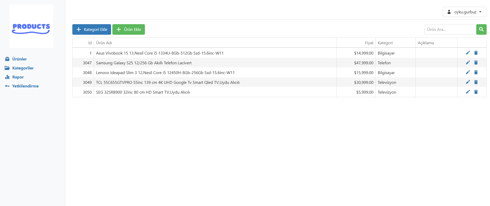

#### Ürün Ekleme PopUp görünümü: 

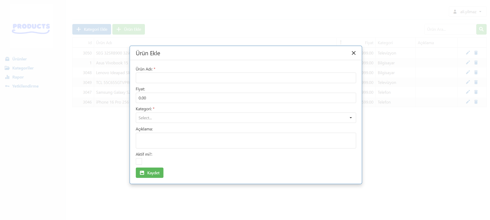

#### Ürün Düzenleme PopUp görünümü: 

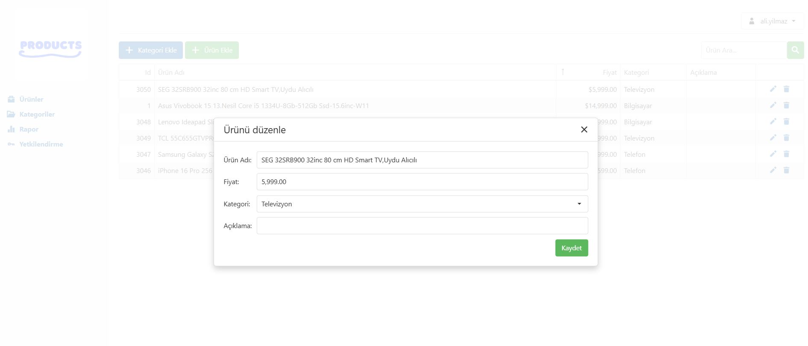

#### Ürün Silme PopUp görünümü: 

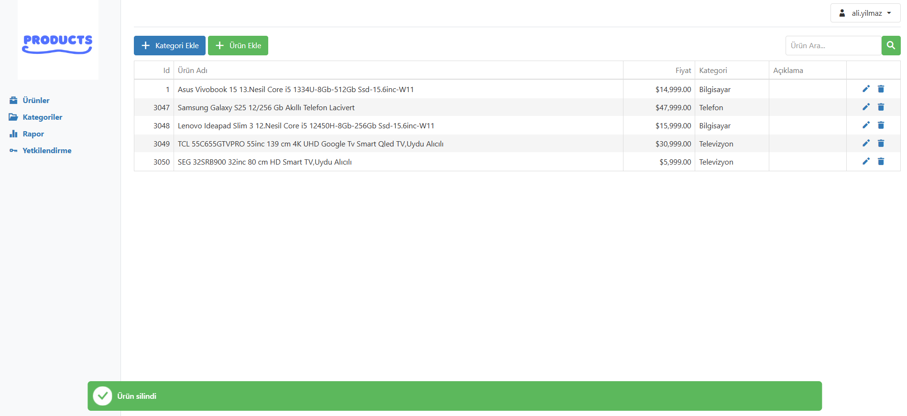

### Kategoriler

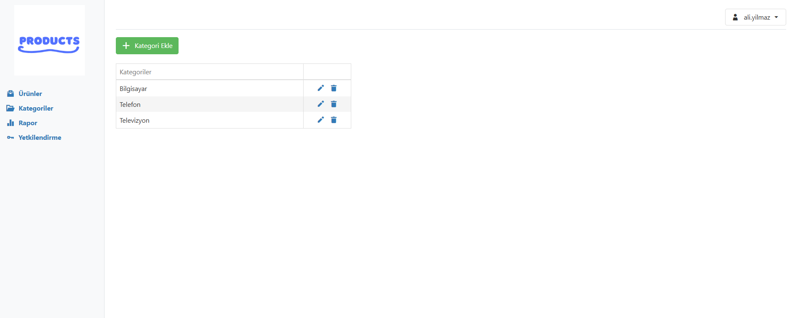

### Rapor
#### Filtreleme:

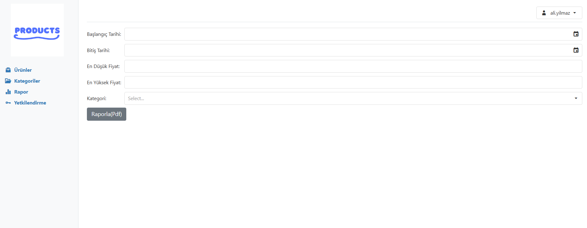

#### Rapor Pdf

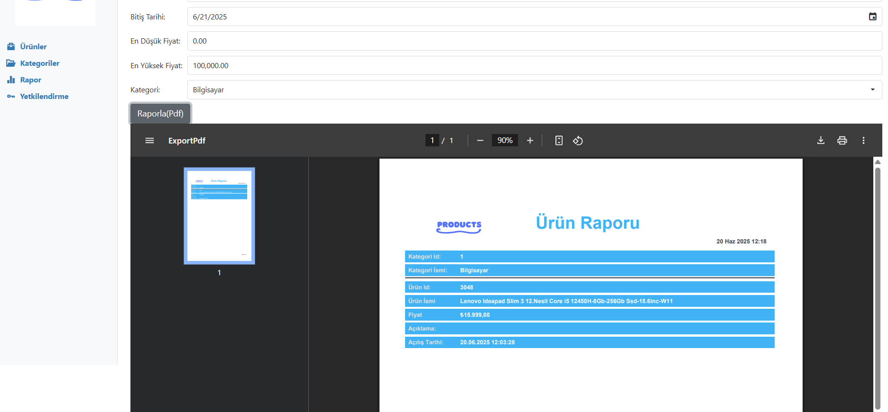

### Yetkilendirme Sayfası 

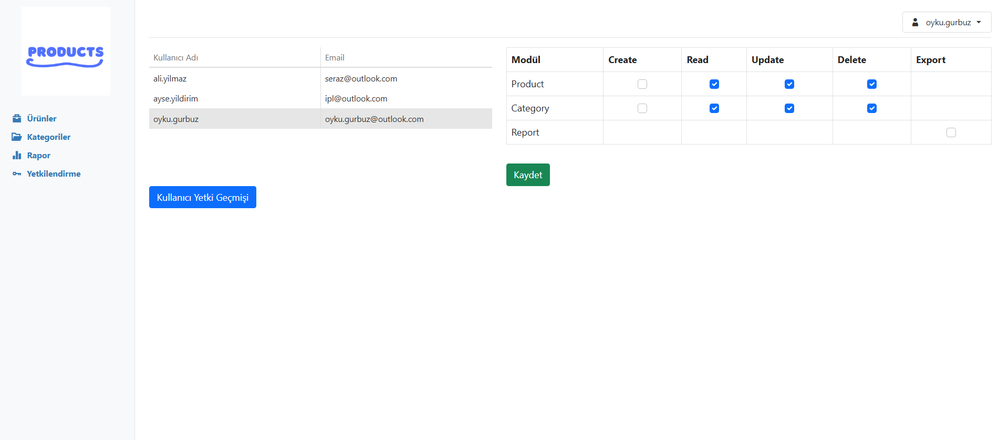

#### Yetkili olmayan kullanıcıya geribildirim

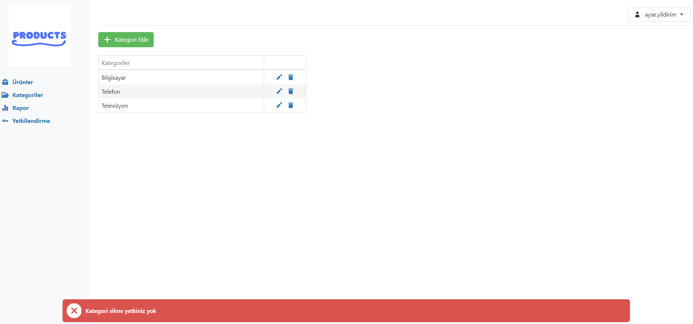
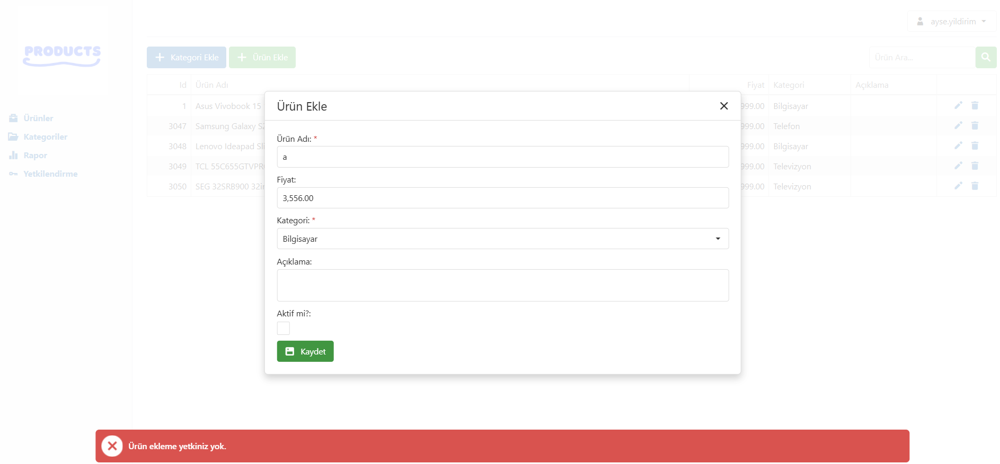

#### Kullanıcı Yetki Geçmişi Takibi ve Filtreleme Modülü

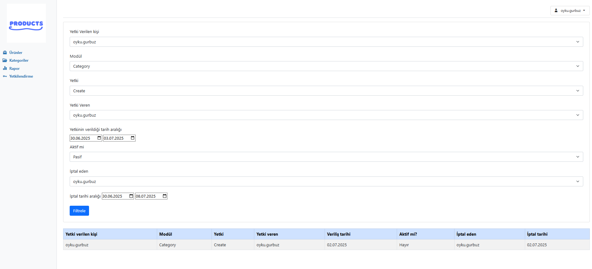

### Excel ile Toplu Kullanıcı Ekleme

#### Excel Import Sayfası
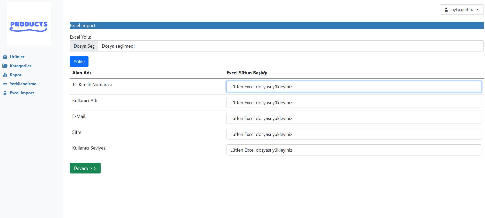

#### Excel dosyası yüklenir ve excel sütun başlıkları seçilerek eşleştirme yapılır.

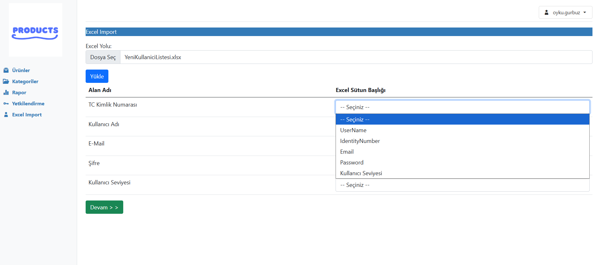

#### Önizleme

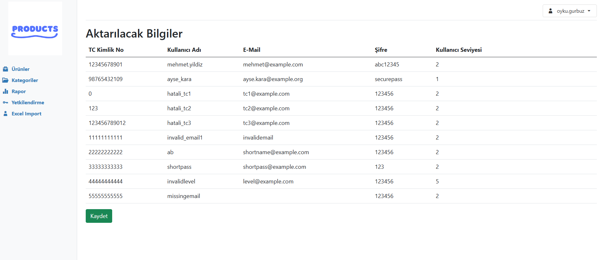

#### Hatalı kayıtların gösterimi

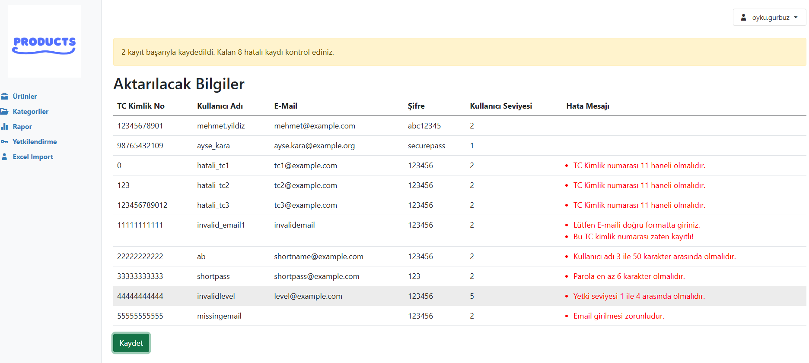